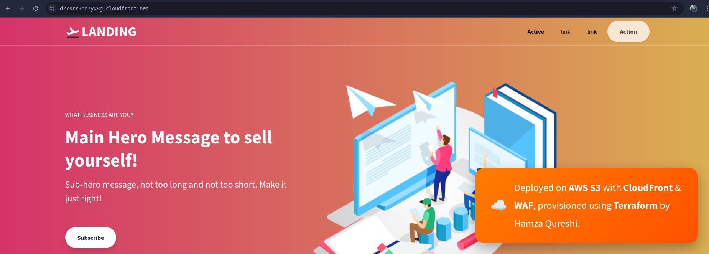
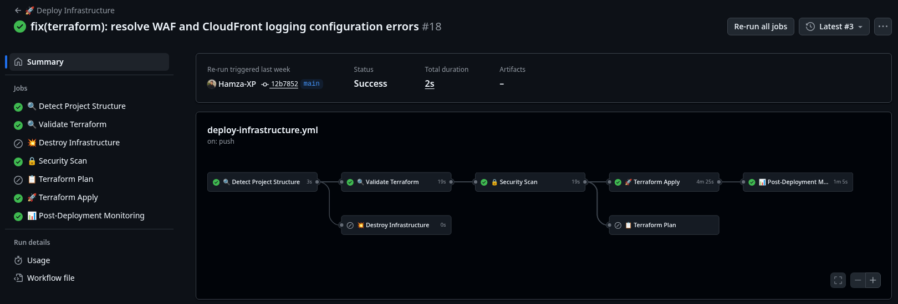

# terraform-s3-secure
<p align="left">
  
  
  
  
  
</p>

## Secure Static Website Infrastructure on AWS
This Terraform project automates the deployment of a static website on AWS using industry best practices. It integrates S3 for storage, CloudFront for global content delivery, and AWS WAF with advanced threat protection to defend against OWASP Top 10 vulnerabilities. Designed for zero-downtime deployments, the infrastructure includes automated CI/CD, real-time monitoring, and cost-optimized scaling—all managed as code.



## 🏗️ Architecture Overview

```mermaid
graph LR

  %% ============= USER ENTRY =============
  U[👤 User] --> R53[📡 Route 53<br/>DNS & Domain Routing]

  %% ============= DISTRIBUTION =============
  R53 --> CF[🌍 CloudFront CDN<br/>Global Distribution + Caching]
  CF --> ACM[🔐 ACM SSL Certificate<br/>TLS/SSL + Auto Renewal]
  CF --> HEADERS[📋 Security Headers<br/>HSTS, X-Frame, Content-Type]

  %% ============= SECURITY LAYER =============
  CF --> WAF[🧱 AWS WAF<br/>Rate Limiting + Managed Rules + Geo Restriction]
  WAF --> OAC[🚫 Origin Access Control<br/>Restrict Direct S3 Access]

  %% ============= STORAGE BACKEND =============
  OAC --> S3[(🪣 S3 Bucket<br/>Static Website + Versioning + Encryption)]
  ENC[🔑 S3 Encryption<br/>SSE-S3 / KMS] --> S3

  %% ============= MONITORING & LOGGING =============
  CF --> LOGS[(🗂️ Access Logs<br/>Stored in S3)]
  LOGS --> LIFE[🕒 Log Lifecycle<br/>Retention + Cleanup]

  CF --> CW[📈 CloudWatch Dashboard<br/>Metrics + Visualization]
  CW --> ALARM[🚨 CloudWatch Alarms<br/>4xx/5xx Error Detection]
  ALARM --> SNS[📩 SNS Notifications<br/>Critical Alerts]
  ```
---

This project creates a robust, scalable infrastructure with the following components:

### Core Infrastructure
- **S3 Bucket** - Secure static website hosting with versioning and encryption
- **CloudFront CDN** - Global content delivery with caching optimization
- **ACM SSL Certificate** - Free SSL/TLS certificates with auto-renewal
- **Route 53** (optional) - DNS management for custom domains

### Security Features
- **AWS WAF** - Web Application Firewall with multiple protection layers:
  - Rate limiting (2000 requests per 5 minutes per IP)
  - AWS Managed Core Rule Set
  - Known Bad Inputs protection
  - Geographic restrictions
- **Origin Access Control** - Restricts direct S3 access
- **Security Headers** - HSTS, X-Frame-Options, Content-Type-Options
- **Encryption** - S3 server-side encryption enabled

### Monitoring & Logging
- **CloudWatch Alarms** - 4xx/5xx error rate monitoring
- **CloudWatch Dashboard** - Real-time metrics visualization
- **SNS Notifications** - Alert system for critical issues
- **Access Logs** - CloudFront request logging to S3
- **Log Lifecycle** - Automatic log retention and cleanup

## 🔄 CI/CD Integration Deep Dive



## 🧩 Detailed CI/CD Stage Breakdown

| **CI File** | **Stage** | **Purpose** | **Tools** | **Triggers** |
|--------------|------------|--------------|-------------|---------------|
| **Deploy Infrastructure** | **Setup** | 🔍 Detect project structure, initialize environment variables, and prepare Terraform backend configuration | GitHub Actions, Terraform | Manual Dispatch |
| **Deploy Infrastructure** | **Validate** | ✅ Run `terraform validate` to ensure syntax and configuration integrity before deployment | Terraform CLI | Manual Dispatch |
| **Deploy Infrastructure** | **Security Scan** | 🔒 Perform security checks on Terraform configurations and AWS policies (e.g., missing encryption, public buckets) | tfsec, checkov, AWS CLI | Manual Dispatch |
| **Deploy Infrastructure** | **Plan** | 📋 Generate a detailed Terraform plan to preview infrastructure changes and detect drift | AWS CLI, Terraform | Manual Dispatch |
| **Deploy Infrastructure** | **Apply** | 🚀 Apply Terraform configurations to provision or update AWS resources including S3, CloudFront, and WAF | GitHub Actions, Terraform, AWS CLI, jq | Manual Dispatch |
| **Deploy Infrastructure** | **Post-Deploy Checks** | 📊 Verify deployment success, validate outputs, and log CloudFront distribution details | AWS CLI, jq | Manual Dispatch |
| **Destroy Infrastructure** | **Setup** | ⚙️ Initialize Terraform backend and environment for teardown | Terraform, AWS CLI | Manual Dispatch |
| **Destroy Infrastructure** | **Resource Discovery** | 🔍 Identify all related CloudFront, S3, and WAF resources for safe deletion | AWS CLI, jq | Manual Dispatch |
| **Destroy Infrastructure** | **Disable Distributions** | ⛔ Disable CloudFront distributions to allow deletion | AWS CLI | Manual Dispatch |
| **Destroy Infrastructure** | **Delete Resources** | 💣 Execute Terraform destroy or AWS CLI commands to remove infrastructure components | Terraform, AWS CLI | Manual Dispatch |
| **Destroy Infrastructure** | **Cleanup & Logging** | 🧹 Clean up orphaned resources, remove logs, and summarize results in GitHub Actions output | AWS CLI, jq | Manual Dispatch |

---

## 📁 Project Structure

```
.
terraform-s3-secure
├── .github/
│   └── workflows/
│       └── deploy-infrastructure.yml    # GitHub Actions CI/CD pipeline
├── terraform/
│   ├── main.tf                         # Main Terraform configuration
│   ├── versions.tf                     # Provider version constraints
│   ├── outputs.tf                      # Output definitions
│   ├── terraform.tfvars.example        # Example variables file
│   └── terraform.tfvars                # Your actual variables (git-ignored)
├── scripts/
│   ├── deploy.sh                       # Deployment automation script
│   ├── monitoring.sh                   # Infrastructure monitoring script
│   └── analyze-logs.sh                 # Log analysis and security reporting
├── website/
│   ├── index.html                      # Your website content
│   └── assets/
│       └── *.png                       # Static assets
├── README.md                           # Main documentation
├── .gitignore                          # Git ignore rules
├── .pre-commit-config.yaml             # Pre-commit hooks configuration
└── Makefile                            # Static assets
```

## ⚙️ Configuration Options

### terraform.tfvars Variables

| Variable | Description | Default | Required |
|----------|-------------|---------|----------|
| `domain_name` | Your website domain | `example.com` | Yes |
| `environment` | Environment name | `production` | No |
| `project_name` | Project identifier | `secure-website` | No |
| `allowed_countries` | Geo-blocking whitelist | `["US", "CA", ...]` | No |

### Example Configurations

**Production Environment:**
```hcl
domain_name = "mycompany.com"
environment = "production"
project_name = "company-website"
allowed_countries = ["US", "CA", "GB", "DE", "FR", "AU"]
```

**Development Environment:**
```hcl
domain_name = "dev.mycompany.com"
environment = "development"
project_name = "company-website-dev"
allowed_countries = ["US"]
```

## 🔒 Security Features

### WAF Protection Layers

1. **Rate Limiting**
   - 2000 requests per 5-minute window per IP
   - Automatic blocking of excessive requests

2. **AWS Managed Rules**
   - Core Rule Set: OWASP Top 10 protection
   - Known Bad Inputs: Protection against malicious payloads

3. **Geographic Restrictions**
   - Country-level access control
   - Configurable allow/deny lists

4. **HTTPS Enforcement**
   - Automatic HTTP to HTTPS redirects
   - Modern TLS configurations

### Security Headers

All responses include security headers:
- `Strict-Transport-Security`: Force HTTPS connections
- `X-Frame-Options`: Prevent clickjacking attacks
- `X-Content-Type-Options`: Prevent MIME-type sniffing
- `Referrer-Policy`: Control referrer information

## 📊 Monitoring & Alerting

### CloudWatch Metrics

The infrastructure automatically monitors:
- **Request Count**: Total requests to CloudFront
- **Error Rates**: 4xx and 5xx error percentages
- **Bytes Transferred**: Upload and download volumes
- **Cache Hit Ratio**: CloudFront caching efficiency

### Automated Alerts

Configured alarms trigger when:
- 4xx error rate exceeds 5% (2 consecutive periods)
- 5xx error rate exceeds 1% (2 consecutive periods)

### Dashboard Access

View real-time metrics at:
```
https://console.aws.amazon.com/cloudwatch/home#dashboards
```

## 💰 Cost Optimization

### Included Cost Controls

1. **S3 Lifecycle Policies**
   - Automatic log deletion after 90 days
   - Non-current version cleanup after 30 days

2. **CloudFront Pricing**
   - PriceClass_100: North America and Europe only
   - Optimized caching for static assets

3. **Resource Tagging**
   - Complete resource tagging for cost allocation
   - Environment-based cost tracking

### Estimated Monthly Costs

For a typical small website (1GB transfer, 100K requests):
- **S3**: ~$0.50/month
- **CloudFront**: ~$1.00/month
- **WAF**: ~$1.00/month
- **CloudWatch**: ~$0.50/month
- **Total**: ~$3.00/month

## 🔧 Maintenance & Operations

### Regular Tasks

1. **Certificate Renewal**
   - ACM certificates auto-renew
   - Monitor certificate expiration in CloudWatch

2. **Log Analysis**
   - CloudFront logs stored in S3
   - Use AWS Athena for log analysis

3. **Security Updates**
   - WAF rules auto-update via AWS managed rules
   - Review CloudWatch alarms monthly

### Troubleshooting

**Common Issues:**

1. **SSL Certificate Validation**
   ```bash
   # Check certificate status
   aws acm describe-certificate --certificate-arn $(terraform output -raw ssl_certificate_arn)
   ```

2. **CloudFront Cache Issues**
   ```bash
   # Create cache invalidation
   aws cloudfront create-invalidation --distribution-id $(terraform output -raw cloudfront_distribution_id) --paths "/*"
   ```

3. **WAF Blocking Legitimate Traffic**
   ```bash
   # Check WAF logs in CloudWatch
   aws logs describe-log-groups --log-group-name-prefix "aws-waf-logs"
   ```

## 📝 Customization Guide

### Adding New File Types

To support additional file types, add cache behaviors to `main.tf`:

```hcl
ordered_cache_behavior {
  path_pattern     = "*.css"
  allowed_methods  = ["GET", "HEAD", "OPTIONS"]
  cached_methods   = ["GET", "HEAD", "OPTIONS"]
  target_origin_id = "S3-${aws_s3_bucket.website.bucket}"
  
  forwarded_values {
    query_string = false
    cookies {
      forward = "none"
    }
  }
  
  min_ttl                = 0
  default_ttl            = 86400
  max_ttl                = 31536000
  compress               = true
  viewer_protocol_policy = "redirect-to-https"
}
```

### Custom WAF Rules

Add custom protection rules:

```hcl
rule {
  name     = "BlockBadUserAgents"
  priority = 5

  action {
    block {}
  }

  statement {
    byte_match_statement {
      search_string = "BadBot"
      field_to_match {
        single_header {
          name = "user-agent"
        }
      }
      text_transformation {
        priority = 0
        type     = "LOWERCASE"
      }
      positional_constraint = "CONTAINS"
    }
  }

  visibility_config {
    cloudwatch_metrics_enabled = true
    metric_name                = "BlockBadUserAgents"
    sampled_requests_enabled   = true
  }
}
```

## 🎯 Best Practices Implemented

### Infrastructure as Code
- ✅ Version-controlled infrastructure
- ✅ Reproducible deployments
- ✅ Environment separation
- ✅ Resource tagging strategy

### Security
- ✅ Principle of least privilege
- ✅ Encryption at rest and in transit
- ✅ WAF protection layers
- ✅ Security headers implementation

### Monitoring
- ✅ Comprehensive logging
- ✅ Proactive alerting
- ✅ Performance monitoring
- ✅ Cost tracking

### Operations
- ✅ Automated deployments
- ✅ Disaster recovery ready
- ✅ Maintenance procedures
- ✅ Documentation

## 📚 Additional Resources

- [AWS CloudFront Documentation](https://docs.aws.amazon.com/cloudfront/)
- [AWS WAF Developer Guide](https://docs.aws.amazon.com/waf/)
- [Terraform AWS Provider](https://registry.terraform.io/providers/hashicorp/aws/)
- [AWS Well-Architected Framework](https://aws.amazon.com/architecture/well-architected/)

## 🤝 Contributing

1. Fork the repository
2. Create a feature branch
3. Make your changes
4. Test thoroughly
5. Submit a pull request

## 📄 License

This project is licensed under the MIT License - see the LICENSE file for details.

---
